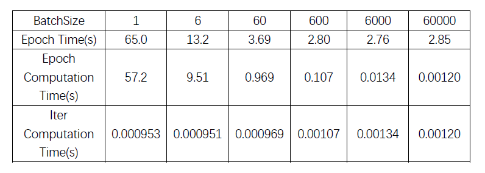
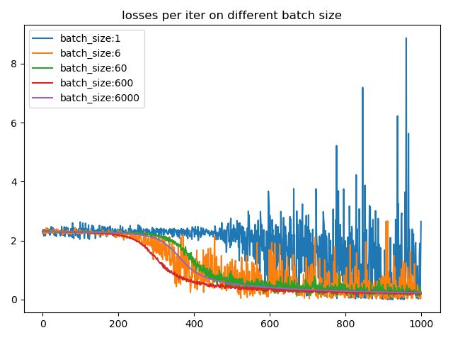
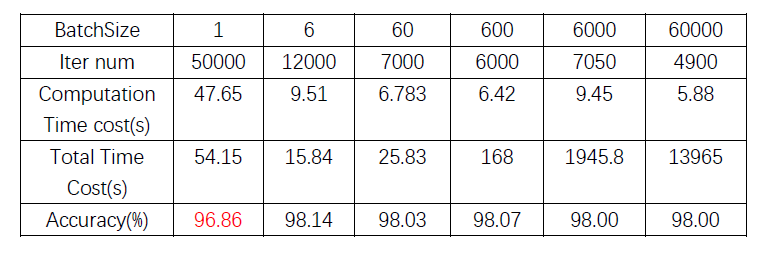

# Batch_Size effects on training results and efficiency

## GPU
>As Nvdia has brought us with well-optimized GPU and calculating platform(CUDA and etc.) ,we can say that the capability of **concurrent calculating** is gaining a massive boosting.  
Thus, the "batch size"  can be a extremely significant parameter for training efficiency and result.

## Effects

### Speed 

The effect that **batch size** brings on efficiency is obvious.  

When we set a very large batch size, the speed of calculation can be very fast with GPU. 

### Accuracy

However, we may get a **disappointing accuracy** when the batch size is too **large**.   

#### Smoothness of the curve   

In the mainstream method of loss function in each mini-batch, we calculate the **mean** of **loss value**(gradient)  and do the **backward pass**
[(see backpropagation)](https://en.wikipedia.org/wiki/Backpropagation).  

Thus, when the batch size is too low (see the purple one below),the difference between mini-batches enlarges. So the curve will look not that smooth, which means the **speed of convergence** which means the **speed to be in an high accuracy** shrinks.
When the batch size is too large(see the blue  one blow), the difference between mini-batches shrinks,which is likely to involve into a [**local minima**](https://en.wikipedia.org/wiki/Maxima_and_minima)

As the chart illustrates, low batch_size means **more iterations** to be accurate.

