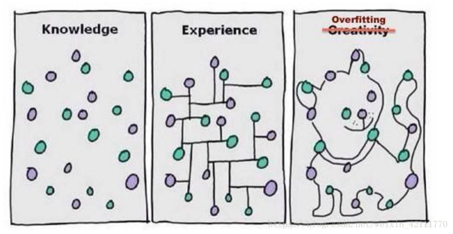
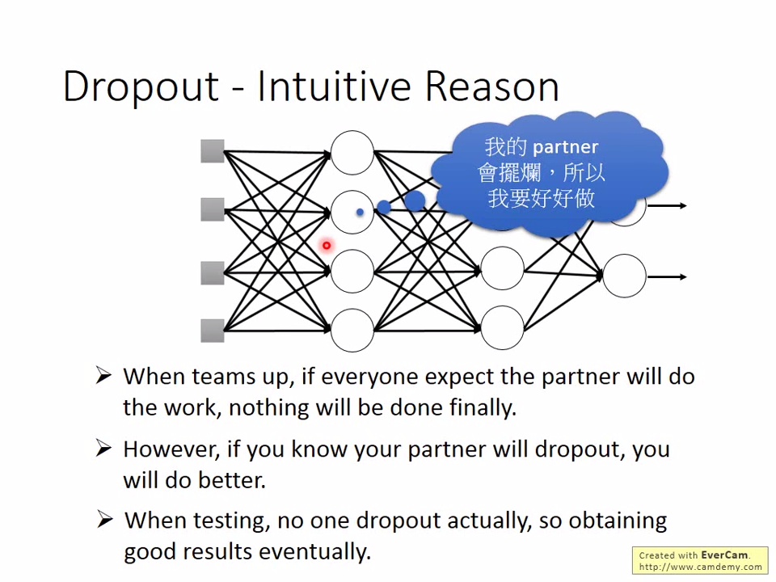
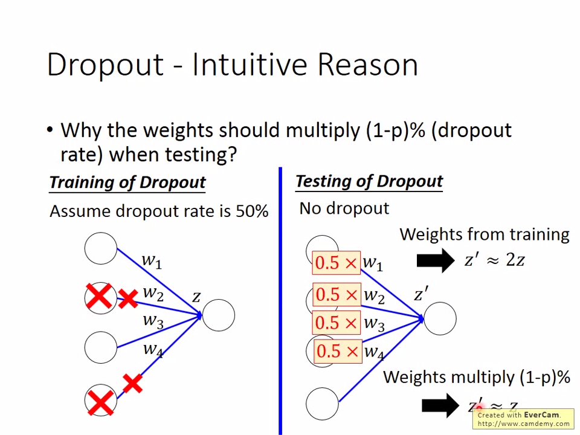
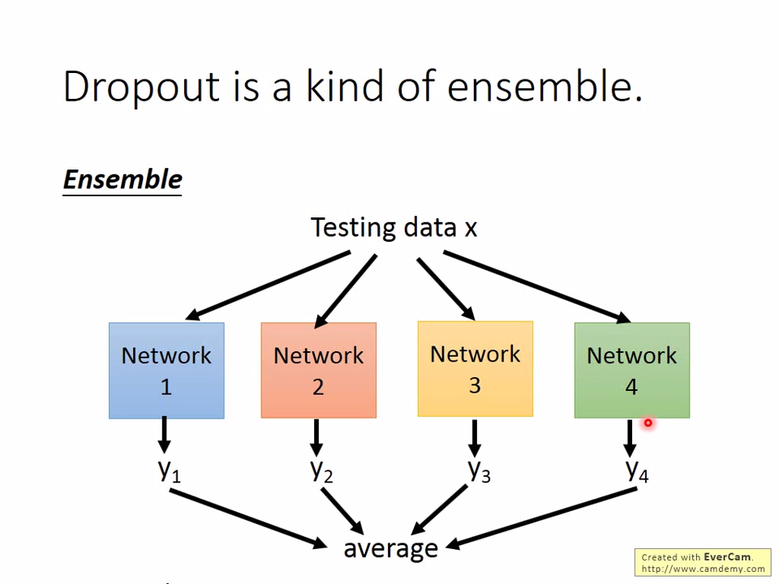
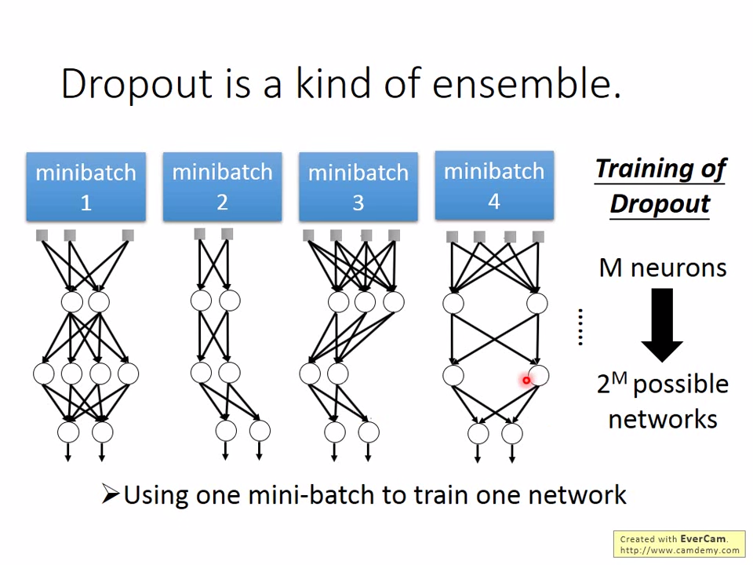

# Methods to imporve OVERFITTING

## What OVERFITTING looks like?

>Normally, when a model performs **well** in **train data set** but **poor** in **test set**.

***
## Why OVERFITTING?

### Model

When it comes to overfitting, we should really think about the **model** in use.

Once it get too much complexity, the problem of efficiency and overfitting arises.

### Data set

When you feed too **little** size of data set for **training** ,the problem arises.

### Unvoidable Problem

The problem of OVERFITTING is **unavoidable** because you will never know which size is proper to gain the equilibrim between **efficiency** and the 
***solution of overfitting***

However, what we can do is to relief the problem.Thus, we have these method to **improve** the situation.

## Solutions

### Early Stopping

>Define a validation function 

Stop when epoch in a minima of  **validation** Total Loss

[See Keras API](https://keras.io/api/callbacks/#earlystopping)

### **Regularization**

$L'(\theta) = L(\theta)+\lambda \frac{1}{2}||\theta||_{2}$->Regularization term

$L(\theta)$: **Original Loss**  
(Eg. minimize suqare error, cross entropy) 

$\theta=\{w_{1},w_{2},...\}$

#### **L2 Regularization:**  
$||\theta||_{2}=(w)^{2}+w^{2}+...$  
***
$L'(\theta)=L(\theta)+\lambda\frac{1}{2}||\theta||_{2}$  
**Gradient**: 
$\frac{\partial L^{2}}{\partial w}=\frac{\partial L}{\partial w}+\lambda w$  
**Update:** $w_{t+1} \rightarrow w^{t}-\eta \frac{\partial L'}{\partial w}\\=w_{t} -\eta(\frac{\partial L}{\partial w}+\lambda w_{t})$
$\\=(1-\eta \lambda)w_{t} - \eta \frac{\partial L}{\partial w}$

$tip:(1-\eta \lambda) \rightarrow0$  

>The L2 regularization also named [Weight Decay](https://papers.nips.cc/paper/563-a-simple-weight-decay-can-improve-generalization.pdf)

#### **L1 Regularzation**
* New loss function to be minimized

$L'(\theta) = L(\theta) + \lambda \frac{1}{2}||\theta||_{1}$

$\frac{\partial L}{\partial w}=\frac{\partial L}{\partial w}+ \lambda sgn(w)$

>$sgn(w)=\begin{cases}
    1,\ x>0\\
    0,\ x=0\\
    -1,\ x<0\\
\end{cases}$

* **Update**

$w_{t+1} \rightarrow w_{t} - \eta \frac{\partial L'}{\partial w} \\= w_{t} - \eta (\frac{\partial L}{\partial w}+\lambda sgn(w_{t}))\\=w_{t} - \eta \frac{\partial L}{\partial w}-\eta \lambda  sgn(w_{t})  
$

>Always delete $\lambda \eta sgn(w_{t})$

Difference between L1 and L2:  

* Training **FASTER** when using L1
* Small $w_{t}$ case:
  * Unremarkable Descent in L2
  * Remarkable Descent in L1
*  Large $w_{t}$ case:
   *  Descent Faster in L2
   *  Slower in L1(lead to inaccuracy)

### Dropout

>Make Neuron Network **Thinner** to reduce the complexity

**Drop out in training**  
* Each neuron has p% to dropout$\ \rightarrow$  The  structure is changed
* Using the new network for training
  
  >For each mini-batch,we resample the dropout neurons

**No dropout** when testing 
* If the dropout rate at training is **p%**,  
  **all the weight times (1-p)%**
* Assume that the dropout rate is 50%.
If a weight $w =1$ by training ,set $w=0.5$ for testing

**Intuitive Reason**  

* Why the weight should multiply $(1-p)\%$(dropout rate) when testing?

### Ensemble(kaggle utility)

>**Dropout** is a special situation from **Esemble**

