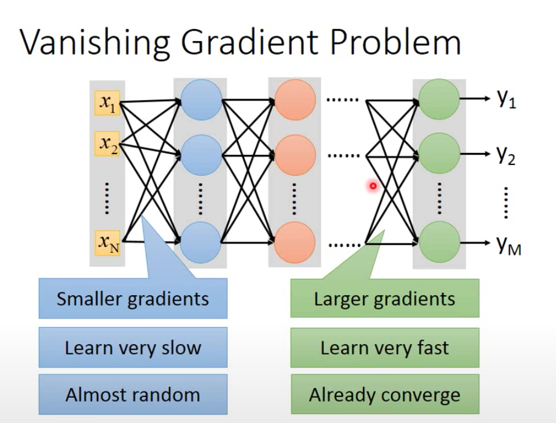
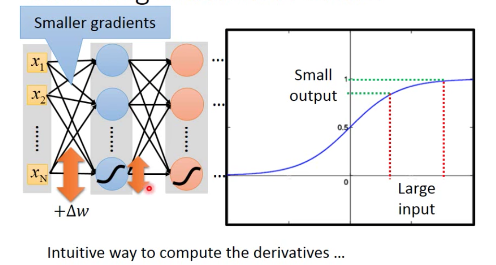
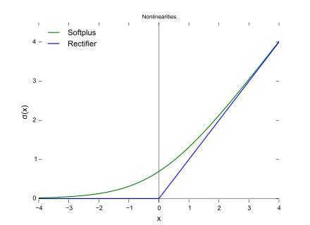
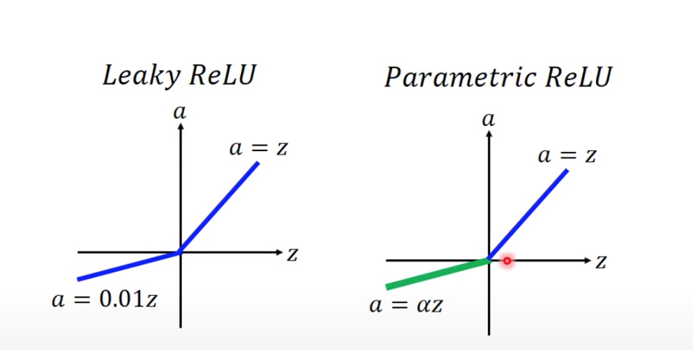
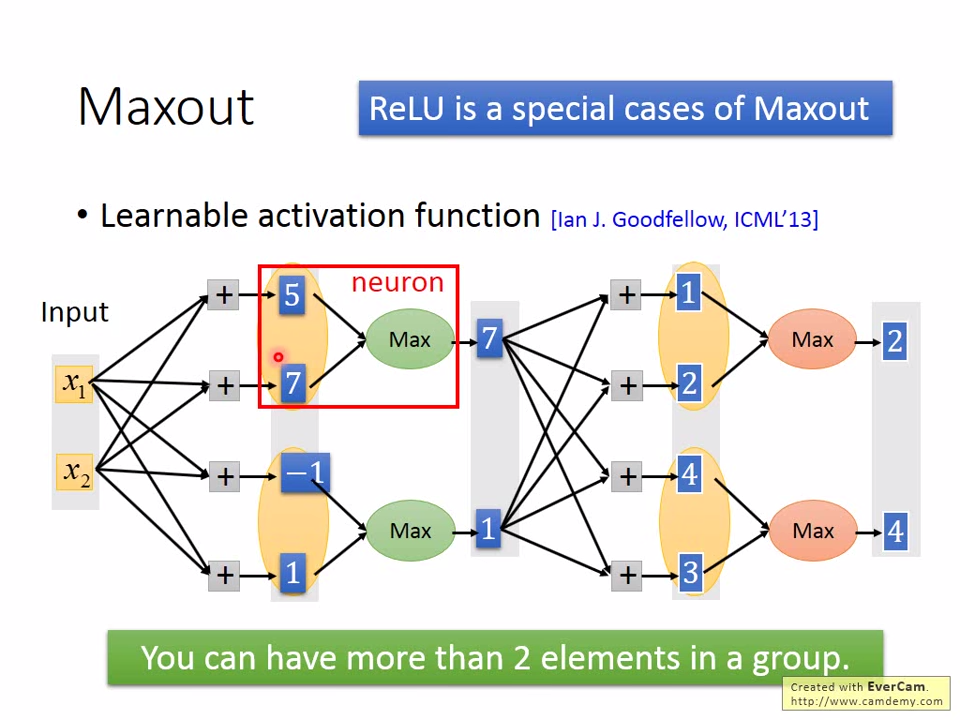
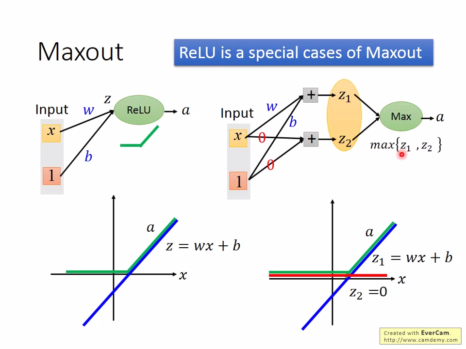
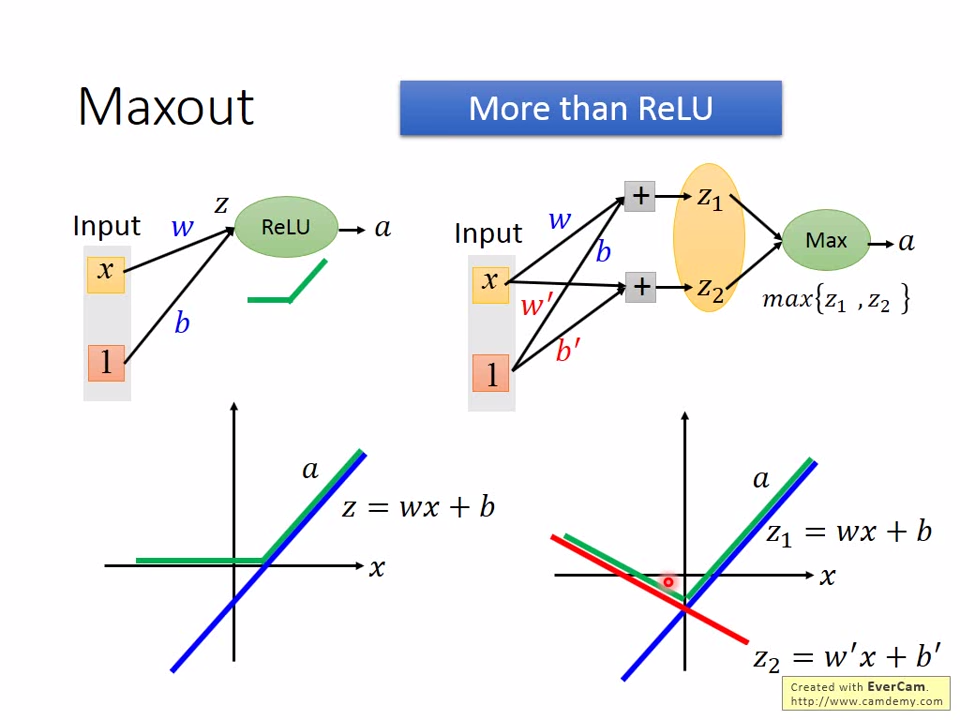
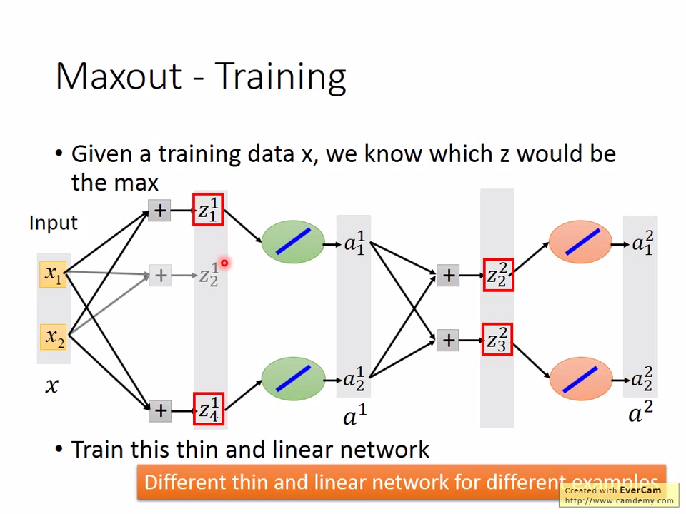

# Tips for DNN

## Vanished Gradient Problem

In our previous neuron network building, we used **sigmoid** as an activate function 

$\sigma$(z)=$\frac{1}{1+e^{-z} }$

However, the **activate function** may have some problems.  

### Too Deep Network

As the network deepen, the gradient in deeper layer tend to be larger.  
$\Delta depth ⬆ \to\Delta w⬆$

 When the input gradient was very **low**, the output side has already complete the **converge** (**high gradient**).

 

 When input changes, output changes very **slow** in **output**

 ## Solutions

 ### Better activate function

#### ***ReLU*** 
> **Rectified Linear Unit:**
>An activate function  defined as the positive part of its argument

$f(x)=x^{+} =max(0,x)$    
 

Reasons:
1. Fast to compute
2. Infinite sigmoid with different **biases**
3. Biological reason

Problems:
1. Linear: considered as non-linear in different regions
2. Unable to **differential**  (Do not have **smaller** **gradient**)

#### ***ReLU - variant***

### Maxout

>**idea:**   
**learnable **activation function****

1. input value multipies weight 
2. find the max value as the input of next neuron
3. next iteration

**tip:** ReLU is a special cases of Maxout

### Maxout-Training
***point***  
Find the max **z** value, discard the others.

### Adaptaive Learning Rate

